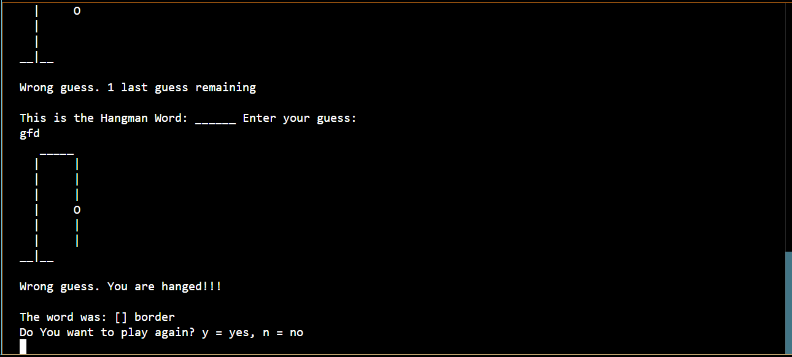

# Hangman_Game_Python
Going back to our old school days, some of the pen-paper games were always a top for our leisure time. Hangman was one, other than some chit games, to guess words according to the guesses determined and as soon as they lost all their wrong guesses, they were hanged (not really, but on paper 😉). That is an old way, now to play Hangman.

